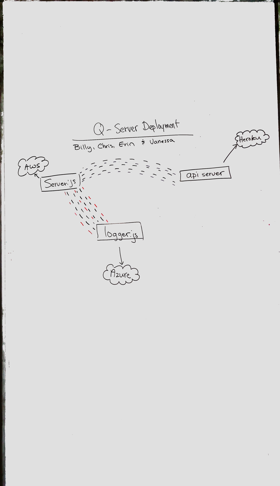

 LAB
=================================================

## Message Queue Server

### Authors: Billy Bunn, Vanessa Wei, Erin Trainor, Chris Merritt

### Links, Resources and Documentation
* Message Queue 
  * [PR](https://github.com/401-advanced-javascript-401d29/lab-19-message-queue-server/pull/1)
  * 
  <!-- * [back-end](http://xyz.com) () -->
  * [jsdoc](http://localhost:3000/docs) (All assignments)

* File Writer

  * [PR](https://github.com/401-advanced-javascript-401d29/lab-19-file-writer/pull/1)
  * 
  <!-- * [back-end](http://xyz.com) () -->
  * [jsdoc](http://localhost:3000/docs) (All assignments)

* API Server
  <!-- * [PR](https://github.com/401-advanced-javascript-401d29/lab-19-message-queue-server/pull/1)
  * 
  * [travis](https://www.travis-ci.com/401-advanced-javascript-401d29/lab-19) -->
  <!-- * [back-end](http://xyz.com) () -->
  <!-- * [jsdoc](http://localhost:3000/docs) (All assignments) -->

#### Server:
* Hosted on AWS: 
* Link: [http://qserverawsbcev-env.g9ahyr3d7m.us-east-2.elasticbeanstalk.com/]
* Listens for: 'Create', 'Read', 'Update', 'Delete', 'save', 'error';

#### API Server:
* Hosted on Heroku:
* Link: [https://api-server-401.herokuapp.com/]
* Endpoints:
  * `/signup`
  * `/signin`
  * `/something-to-read`
  * `/hidden-stuff`
  * `/create-a-thing`
  * `/update`
  * `/everything`

#### Logger:
* Hosted on Azure:
* Link: [https://q-logger-azure.azurewebsites.net]
* Creates a new namespace 'database'
* Subscribes to the events: 'delete', 'update', 'read', 'create', 'error', 'save'.
* Logs the event name and payload when heard.

### Setup
#### `.env` requirements
* `MONGODB_URI` - Connection to the mongo database
* `SECRET` - Encrypts the passwords
* `Q_SERVER` - Connection to the Hosted Q server

#### Tests
* How do you run tests?
  * npm run test
* What assertions were made?
  * that the logger exists
* What assertions need to be / should be made?
  * that the server can start and that the logger can log a message in response to an event.

#### UML
